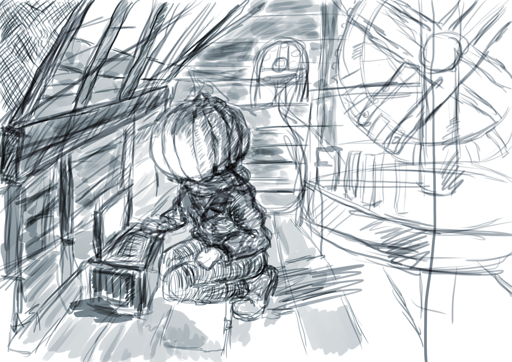

I’m currently rewriting  Beware the Million Men, my novel about a man called Henry who gets caught up in a hundred year war between the Pumpkinmen and their alchemical masters the evil Homunculus. I find images help me write and so I’m reimagining one of the key scenes here where the Pumpkinman Jack is in a windmill in West Sussex. A friend asked to see it, so here’s the progress so far. It’s all done in Photoshop but I’ve been trying to use reference material this time to get the lighting on Jack right.

John

