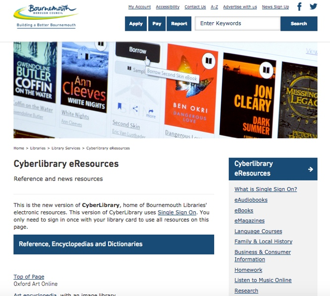

Can we find a new way to use libraries online?

I read a brilliant article by David Weinberger called [There's a library-shaped hole in the Internet](https://www.bostonglobe.com/opinion/2015/07/25/libraries-need-deeper-online-presence/Rzt63eBSHt1WomTqCwYStN/story.html)  which basically says, Libraries have some amazing  content, and some curated collections of content  but that they aren&#39;t that visible on the Internet, you have to visit the building or website or catalogue to find these gems.

>"If you want to know anything about movies, the Internet&#39;s got you covered. Likewise for details about the world&#39;s roadways, song lyrics, or Pokemon characters. But if you want to know about books and the other items of culture we&#39;ve entrusted to libraries, it&#39;s much harder to find out. We&#39;re not even sure what to link to when posting about a book."

**David Weinberger July 26, 2015**

And it got me thinking. Can we find a new way to use libraries online? Let's talk  for a moment about the great things that are available in our libraries:

* Reference tools that are high quality and really useful
* Free eBooks and eAudio books (yes, I did say free)
* Tools to help you learn  hundreds of languages  (again, free)
* Lists of all the great books and films and DVDs you&#39;d love to watch if only you could find them  (library catalogues)

###To do all this we need a few things.

If we want this then we need an easier way to:
1. **discover** content
2. **access** content
3. **discuss** and **browse** content, plus if we wanted to see others are reading or looking at, *maybe* on a **platform.**
4. share what we find in libraries with friends, colleagues or other like-minded souls

If we want to use our libraries better digitally. It's also been called UX or a digital journey[link to Report )) then here are some things that could help. This isn&#39;t a call for one master library system, and there&#39;s nothing wrong with the library house, it just needs better plumbing, a few more signs and to appear on our mobiles and desktops when we are searching and researching.  It&#39;s a shout out for them to be better connected and above all easier to use.

## Discover Library books in your google results

 Westminster Libraries have a brilliant project where you can search google (not the library catalogue) and if you search for  a book then it will come up in google&#39;s results AND tell you where the nearest library is. Amazing. The technology for this was developed by Library of Congress, the standard is called Bibframe, and there&#39;s a company called Zepheira who transform it so that search engines can easily find it.  If I had a wish it would be that all library&#39;s had this. Imagine searching google and being told that your library has a copy for you to borrow?  It puts all that amazing information where we are searching.
 
 
 
 

## Access  resources 

I guess I should talk about why I'm so passionate about this.

I'm a librarian with a strong book/digital vein running through me.  I helped SCL decide  get Single Sign On into public libraries to make it easier for people to  login to their library's  online eResources,  (all those free encyclopedias and language courses that your library has paid for you to use). You can read about #SingleSignOn  {videolink} here but basically Single Sign On signs you into all your resources in one hit ( no more fumbling for your library card) I now work for Jisc promoting SSO but I'm doing it because I'm passionate about making it easier to use your library digitally.

## **A Platform to Discover and share**

The British Library are investigating **Single Digital Presence** to see:

1. What it could achieve
2. If people want it

If it goes ahead then it could revolutionise the way we access  our libraries and open the way to allow other organisations like the BBC, Reading Agency, the BFI etc.  to help and reach us as library users.

At the moment if I have library cards for three different  library services then I have to visit each website. Single Digital Presence  could make that one  digital visit.

When the summer reading  challenge,  the Reading Agency, a publisher or Sport England says 'visit your local library' then instead of clicking 1 > to find your library's website 2> to find the catalogue 3 to find the books 4 to log in

The Sport England page would show *directly* books and dvds in **your library**  to reserve or go in and borrow.

## Further reading

- [Catalogue discoverability – a marked improvement](https://librariestaskforce.blog.gov.uk/2018/02/13/catalogue-discoverability-a-marked-improvement/) by Catherine Cooke,
- [Society of Chief Librarians -  Single Sign On](http://goscl.com/single-sign-on/)
-   [The intrinsic value of libraries as public spaces](https://www.civica.com/globalassets/7.document-downloads/3.au-docs/white-papers/civica-changing-landscape-report-physicaldigital-libraries.pdf) - discusses digital journeys (Civica  Institute for Public Policy &amp; Governance (UTS: IPPG) at the University of Technology Sydney.
- [British Library to investigate possibility of a &#39;single digital presence&#39; for UK public libraries](file:///tmp/d20180410-4-5uin34/British%20Library%20to%20investigate%20possibility%20of%20a%20&#39;single%20digital%20presence&#39;%20for%20UK%20public%20libraries)
- [Essential Digital Infrastructure for Public Libraries in England: A Plan moving forward&#39;](http://goscl.com/wp-content/uploads/151130-DigitalPlatformFinalReport.pdf) SCL commissioned report by Bibliocommons

(….and yes [L - space](https://en.wikipedia.org/wiki/List_of_dimensions_of_the_Discworld#L-space) is a reference to that most wonderful multidimensional space that Pratchett describes in the Discworld)

