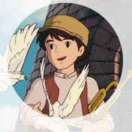

# The Light Beckons
So these are six worlds I thought might be fun to play in, with. If they interest you, hit me up on @informationhead 
##Six Worlds 
### 1.  Myazaki’s World 
	
	
	. Laputa and floating cities 
  Avalonians 
	. hidden Deepwater Atlantiads. 
	. Guardian automatons
	. A real sense of wonder

### 2.  The Hidden World
 	
	- Guns and Devils  -  adventures in the underworld
	- Make a deal with a devil 

###3.  Palisade
 
An eco dangerous world . What happens when you slay the last  Oryx?’ Answer the ecology upsets. The Oyx are like sharp hairy goblins who eat rats, the rats multiply and eat all the bind weed grasses so the thorn forest spring up, water courses are rerouted. The soil becomes waterlogged and marshy. The deer that eat the bind grass and the tree saplings have to migrate south,   families of Ettins and trolls who like marshy terrain start to move into the thorn forests. 
Aurochs who love  marsh weed and feather lichen move in.   Wyverns and   ogres love the taste of Marsh Auroch and  the ogres lay waste to any village that isn’t protected by palisade or fire. 

###4.  Jack 
Oak Jack and Maui Jack UK and NZ.
You are all tree creatures and mice? 

###5.Monty’s world

British Folklore 
Hairy skeletal things
Toad things 
Period 1895
That wonderful pull toward hidden knowledge 
Monty’s obsessive quality. 

###6.Fey Knights 
Green Knight was the good guy.  One of the Fey Knights. 



